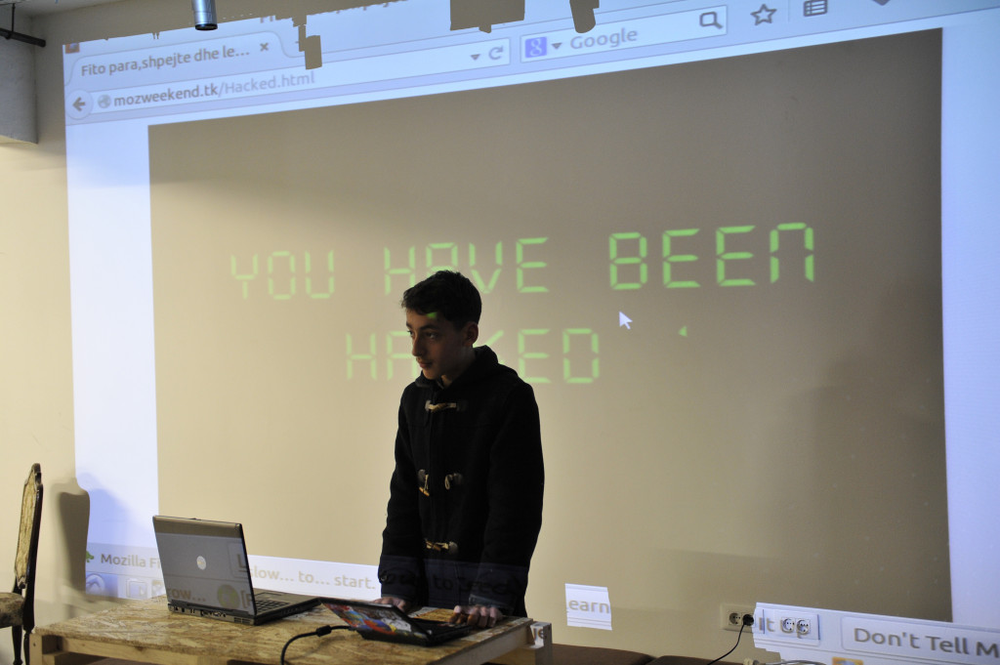

:gitlab_url: https://git.budini.xyz/uncategorized/school-resume/blob/master/events/index.rst

======
Events
======

I have always loved attending events that relate to **open source**. They are what got me started on my journey, and to my belief, are a great way to introduce an idea or a project to many people in an efficient way.

Over the 4 years I've been involved in the open source field, I've been part of both small and big events, mainly the ones organized by the Open Labs Hackerspace in Tirana, where I am a member

In this page you will find an extensive yet incomplete list of events I've been involved at over the course of the last 4 years. They are separated into 3 categories
 1) Events I've spoken at
 2) Events I've volunteered at
 3) Events I've organized

Events I've spoken at
~~~~~~~~~~~~~~~~~~~~~

`Mozilla Weekend 2015 <https://reps.mozilla.org/e/mozilla-weekend-tirana/>`_
----------------------------------------------------------------------------

Mozilla Weekend 2015 is where everything started for me. I attended it not knowing much about neither the community nor the open source world.

I gave a speech there about the importance of staying vigilant while browsing the internet, and the risks one takes when they fall for a scam.

 Organized by the Mozilla Albania Community and 2 Reps in Albania, Elio Qoshi and Redon Skikuli, Mozilla Weekend aims to bring the community closer together by working, socializing and sharing ideas. It also aims into bringing interested people into the community and showing them what Mozilla is about, in order to grow the local community even more It will be held in a well located university in Tirana, for 2 days, 6 hours a day.
**Age: 14**

**Speech Duration: 10 minutes**

**Topic: "The importance of staying vigilant while browsing the internet"**

`OSCAL 2015 <https://wiki.openlabs.cc/faqja/OSCAL_2015>`_
---------------------------------------------------------

This was my first big event. I decided to give an intro to Firefox OS, which was the web-based mobile operating system that was being developed by Mozilla, the maker of Firefox

 OSCAL (Open Source Conference Albania) is the first annual conference in Albania organized to promote software freedom, open source software, free culture and open knowledge, a global movement that originally started more than 30 years ago.
**Age: 14**

**Speech Duration: 15 minutes**

**Topic: "Firefox OS"**

`Link <https://wiki.openlabs.cc/faqja/OSCAL_2015/Axhenda>`_
Note: The wiki has a typo where my name is written as Boris Boudini

`Mozilla & Fedora activity days @ Prishtina Hackerspace <https://communityblog.fedoraproject.org/fedora-mozilla-activity-days-in-prishtina-kosovo>`_
----------------------------------------------------------------------------------------------------------------------------------------------------

 Small talks related to the communities of Mozilla and Fedora

**Age: 15**

`Link <https://ardiansblog.wordpress.com/2016/03/30/fedora-and-mozilla-activity-day-in-kosovo/>`_

`Tech Speakers - Tirana Training #2 <https://reps.mozilla.org/e/tech-speakers-tirana-training-2/>`_
--------------------------------------------------------------------------------------------------

 Mozilla Tech Speakers aims to increase developer awareness and adoption of the Web, Firefox, and Mozilla through a strong community-driven speaker development program. Now we are bringing Tech Speaker lessons, mentors and Mozillians to the local community, offering great insight and experiences to newcomers and late arrivals. The workshop will consist of short lightning talk sessions, followed by feedback, tips on how to stand, non verbal communication, slides creation and much more.

**Age: 16**

**Topic: "Intro to VR"**

`Link <https://wiki.openlabs.cc/faqja/Mozilla_Tech_Speakers_Tirana-_Training_nr.2>`_

`Linux Weekend <https://wiki.openlabs.cc/faqja/Linux_Weekend_Tirana_2017>`_
--------------------------------------------------------------------------

 Linux Weekend is a brand new conference in the city with two days totally dedicated to Linux operating system and all it’s distros. Talks, workshops, infobooths and install fests, all at the same place, Faculty of Information Technology, Politechnic University of Tirana. Inspiring talks and workshops will be presented by very passionate Linux boys and girls, some of which will travel from abroad to come and join us on both days of the conference. From 09:30 AM to 05:00 PM all the participants will be able to attend the presentations they find more attractive to them, to grab a copy of their favorite distro (and the right help to install it) and also the opportunity to get some information on how to be part and contribute in the different open source project that will have their own info-booths during the conference.

**Age: 16**

**Speech Duration: 30 minutes**

**Topic: "Desktop Environments"**

`Link <https://wiki.openlabs.cc/faqja/Linux_Weekend_Tirana_2017#Axhenda>`_

`FOSScamp Syros 2017 <https://wiki.openlabs.cc/faqja/FOSScamp_Syros_2017>`_
--------------------------------------------------------------------------

 The second edition of the summer adventure to spend with free open source geeks from communities all around the Balkans and Europe aside the beach. A week of co-creation for the commons of the beautiful island of Syros. Meet new people, exchange ideas, get inspired, collaborate to organize this un-conference together with the ultimate goal of growing our communities and spreading the free open source communities in every corner of our region. This year we will take 360′ photos of the island, publish them in Wikimedia commons and through a Mozilla WebVR workshop will learn how to create Web VR experiences with the images.

**Age: 17**

**Workshop Duration: 1 hour 30 minutes**

**Topic: "Mozilla WebVR hands on workshop "**

`Link <https://ftp.heanet.ie/mirrors/fosdem-video/2019/UD2.208/how_xr_goes_beyond_demos_and_games.mp4>`_

`Fosdem 2019 <https://fosdem.org/2019/>`_
----------------------------------------

 FOSDEM is a free and non-commercial event organised by the community for the community. The goal is to provide free and open source software developers and communities a place to meet to:
  * get in touch with other developers and projects;
  * be informed about the latest developments in the free software world;
  * be informed about the latest developments in the open source world;
  * attend interesting talks and presentations on various topics by project leaders and committers;
  * to promote the development and benefits of free software and open source solutions.

**Age: 18**

**Speech Duration: 30 minutes**

**Topic: "How XR goes beyond demos and games"**

`Link <https://ftp.heanet.ie/mirrors/fosdem-video/2019/UD2.208/how_xr_goes_beyond_demos_and_games.mp4>`_

Events I've volunteered at
~~~~~~~~~~~~~~~~~~~~~~~~~~

`OSCAL 2015 <https://wiki.openlabs.cc/faqja/OSCAL_2015>`_
---------------------------------------------------------
OSCAL (Open Source Conference Albania) is the first annual conference in Albania organized to promote software freedom, open source software, free culture and open knowledge, a global movement that originally started more than 30 years ago.

`OSCAL 2017 <https://wiki.openlabs.cc/faqja/OSCAL_2017>`_
---------------------------------------------------------
OSCAL (Open Source Conference Albania) is the first annual conference in Albania organized to promote software freedom, open source software, free culture and open knowledge, a global movement that originally started more than 30 years ago.

`OSCAL 2019 <https://wiki.openlabs.cc/faqja/OSCAL_2019>`_
---------------------------------------------------------
OSCAL (Open Source Conference Albania) is the first annual conference in Albania organized to promote software freedom, open source software, free culture and open knowledge, a global movement that originally started more than 30 years ago.

`Linux Weekend <https://wiki.openlabs.cc/faqja/Linux_Weekend_Tirana_2017>`_
--------------------------------------------------------------------------
Linux Weekend is a brand new conference in the city with two days totally dedicated to Linux operating system and all it’s distros. Talks, workshops, infobooths and install fests, all at the same place, Faculty of Information Technology, Politechnic University of Tirana.
Inspiring talks and workshops will be presented by very passionate Linux boys and girls, some of which will travel from abroad to come and join us on both days of the conference. From 09:30 AM to 05:00 PM all the participants will be able to attend the presentations they find more attractive to them, to grab a copy of their favorite distro (and the right help to install it) and also the opportunity to get some information on how to be part and contribute in the different open source project that will have their own info-booths during the conference.

Events I've organized
~~~~~~~~~~~~~~~~~~~~~~~~~~

`OSCAL 2016 <https://wiki.openlabs.cc/faqja/OSCAL_2016>`_
---------------------------------------------------------
 OSCAL (Open Source Conference Albania) is the first annual conference in Albania organized to promote software freedom, open source software, free culture and open knowledge, a global movement that originally started more than 30 years ago.

`WikiWeekend 2016 <https://sq.wikipedia.org/wiki/Wikipedia:Wiki_Weekend_Tirana_2016>`_
--------------------------------------------------------------------------------------
 Wiki Weekend is an annual event which aims to be the contact point for old and new Wikimedians from Albania. The event was first organized in 2014 and during the years hundreds of Wikipeda articles have been created, improved and translated in the Albanian language, hundreds of photos have been uploaded in Wikimedia Commons and tens of new contributors have joined the project.

` Mozilla WebVR workshop #1 <https://wiki.openlabs.cc/faqja/Mozilla_WebVR_Camp_nr._1 >`_
----------------------------------------------------------------------------------------
 WebVR Workshop, held at the Open Labs Hackerspace in Tirana, Albania Our aim is to increase awareness around WebVR and A-Frame.

` Mozilla WebVR workshop #2 <https://wiki.openlabs.cc/faqja/Mozilla_WebVR_Workshop_2#2>`_
-----------------------------------------------------------------------------------------
 WebVR Workshop, held at the Open Labs Hackerspace in Tirana, Albania Our aim is to increase awareness around WebVR and A-Frame.

` Mozilla Common Voice <https://wiki.openlabs.cc/faqja/Mozilla_Common_Voice_Workshop>`_
-----------------------------------------------------------------------------------------
 On this pilot workshop for the Common Voice project, hackerspace members will contribute with their voice, do reviews and submit public domain text to improve the database of the project.

` LulzBot 3D Printing Workshop <https://wiki.openlabs.cc/faqja/LulzBot_3D_Printing_Workshop>`_
----------------------------------------------------------------------------------------------
 Workshop on how to use LulzBot 3D printer

` CryptoParty Tirana 2017 <https://wiki.openlabs.cc/faqja/Cryptoparty_Tirana_2017>`_
------------------------------------------------------------------------------------
 CryptoParty is a decentralized movement with constantly happening activities in the entire world. The goal of this movement is sharing as much knowledge to as many individuals as possible on how to protect ourselves in the digital world. This worldwide effort introduces the basis of cryptography both in theory and practice, such as encrypted communication, prevention of espionage when navigating on the internet, anonymity on Tor network, cryptography with public key, storage encryption, Virtual Private Networks (VPN) etc. The project consists of a series of workshops free and open for everyone. To join this worldwide effort and to inform about the dangers of the digital world, the importance of online privacy and exchange of practical knowledge to protect our privacy, Open Labs with the support of Arjen Kamphuis and Ardian Haxha have organized CryptoParty Tirana.

` CopyFest <https://wiki.openlabs.cc/faqja/CopyFest_2018>`_
-----------------------------------------------------------
 The negative stigma of remixing, copying and modifying can still be noticed in today’s society where the internet is a key part of our life which is nothing alike with the 20th century. Instead, back then creating and exploring was a privilege which many people did not have. With the diversity of cultures, creations and characteristics, a revolution in the field of author’s rights and work modifications is needed. All these are topics which we want to address in the first edition of Copy Fest, a weekend which celebrates public domain, Copyleft & Creative Commons licenses, and copying, remixing and creative freedom on internet. Movie screening, debates and a round table with actors of creative industry with talks about Creative Commons licenses.

`OSCAL 2018 <https://wiki.openlabs.cc/faqja/OSCAL_2018>`_
---------------------------------------------------------
 OSCAL (Open Source Conference Albania) is the first annual conference in Albania organized to promote software freedom, open source software, free culture and open knowledge, a global movement that originally started more than 30 years ago.

` SysAdm <https://wiki.openlabs.cc/faqja/SysAdm>`_
--------------------------------------------------
 7 workshops on how to get started on being a SysAdm

` Identihub Workshop <https://wiki.openlabs.cc/faqja/Identihub_workshop>`_
--------------------------------------------------------------------------
 Identihub is open Source brand and visual assets hosting software which can be self-hosted as well.

` Switching.social translation spree <https://wiki.openlabs.cc/faqja/Switching.social_-_platformat_q%C3%AB_respektojn%C3%AB_privat%C3%ABsin%C3%AB_ton%C3%AB>`_
--------------------------------------------------------------------------------------------------------------------------------------------------------------
 Website hosting a list of ethical, easy-to-use and privacy-conscious alternatives
