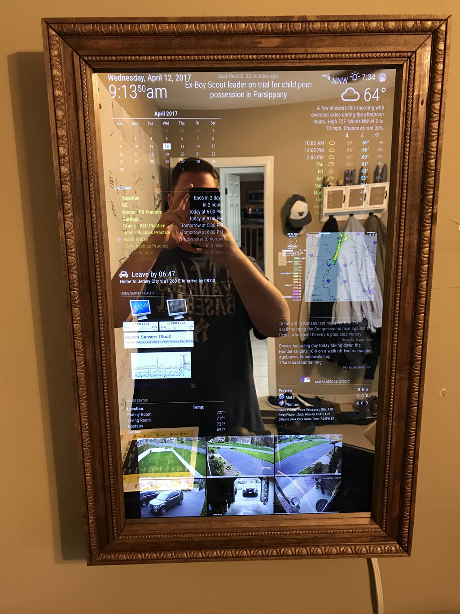

:gitlab_url: https://git.budini.xyz/uncategorized/school-resume/blob/master/projects/index.rst

========
Projects
========
I have always found that making a product/project yourself is the best way to learn. Not only on the technical side of it, but even on management, cost calculation, communication and so on.

Being an open source fanatic, I've had the pleasure of having the help of bigger communities one click always

Since most of these projects were done a long time, I don't have blogs about them nor do I have photos of them. I will however include photos of similar implementation

MagicMirror
-----------
This project started back in 2015. I had been 'gifted' a broken laptop, whose screen worked perfectly well.

So I was inspired by other people making smart mirrors and decided to have my own take into it.

The end result is a mirror which has ALEXA voice integration through an open source client. While I am not proud that it uses ALEXA, it was the best option at the time.

The final implementation looks similar to the image below, but with voice assistant which can be connected to other IoT devices to have a smart home

Home Theater
------------
Being a data hoarder, I have backed up every piece of audiovisual content I own or have bought. I needed a way to manage all this content..

So I decided to get a raspberry pi and put the open source media manager KODI on it, which is then linked to my recycled server for faster performance

Recycled server
---------------
My family has collected a lot of hardware over the year (The huge advancements of technology were to blame). Furthermore, I hate throwing out hardware that can run, no matter how old it is.

So I decided to grab my family's first laptop, which had a maximum memory capacity of 1GB and installed Ubuntu 16.04 CLI edition.

I also had a bunch of semi dead hard drives that were laying around waiting to become a bunch of dusted boxes. I went ahead and took all of them and set them up on a RAID array so that they could be somewhat useful

The end result is a network attached storage with ~3TB of space which runs a DNS server along with Nextcloud, to provide a home server managing experience at a cost of 0$ (if you don't count for electricity usage)
